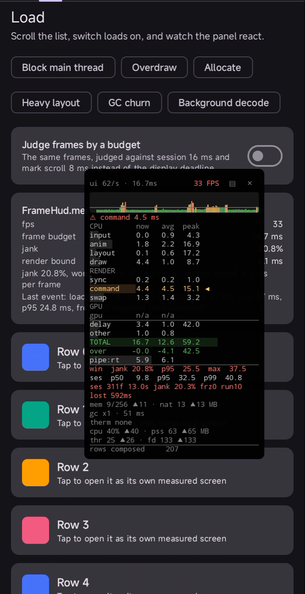

# FrameHUD

[](https://central.sonatype.com/artifact/com.timkrest/framehud)
[](https://github.com/timkrest/FrameHUD/actions/workflows/build.yml)
[](LICENSE)
[](https://developer.android.com/tools/releases/platforms)

[English](README.md) · [Русский](README.ru.md)

A draggable debug panel that shows how long each stage of a frame takes, and which one is slowing
you down.



- **A row per stage.** `input`, `anim`, `layout`, `draw` on the main thread, then `sync`, `command`,
  `swap` on the render thread, and `gpu`
- **Says why frames drop.** Thermal throttling, GC pauses, too few Choreographer ticks, or a late start
- **Keeps the case, not just the number.** A jank burst or a frozen frame is saved with the frames
  around it and the readings of that moment, and with the stack the main thread stood in when it was
  the one stuck
- **Measures your app, not itself.** The panel draws in its own window
- **Fails tests on jank.** A JUnit rule with thresholds
- **Compares with earlier runs.** A baseline per device, so a gate checks the delta instead of a
  fixed number
- **Works without the panel.** `framehud-metrics` collects and reports with no window and no
  permission
- **Made for QA runs.** adb commands, JSON and HTML session exports, sections and counters in a
  system trace
- **Nothing in release builds.** `debugImplementation` leaves out the panel, its provider and the
  `SYSTEM_ALERT_WINDOW` it declares

## Quick start

```kotlin
dependencies {
    debugImplementation("com.timkrest:framehud:0.12.0")
}
```

There is nothing to call. A `ContentProvider` starts the panel, and it follows whichever activity
has focus.

Requires `minSdk` 24. Frame phases come from `FrameMetrics`; GPU timings need API 31+ and a driver
that reports them.

## What the panel shows

```
ui 118/s · 8.3ms  118 FPS
⚠ layout 8.4 ms
CPU       now   avg  peak
input     0.1   0.2   1.1
anim      0.3   0.4   2.0
layout    7.9   8.4  22.3 ◀
draw      1.2   1.4   6.7
RENDER
sync      0.4   0.5   1.9
command   0.6   0.7   3.1
swap      0.2   0.3   1.4
GPU
gpu       2.1   2.4   9.8
delay     0.3   0.4   2.2
other     0.1   0.2
TOTAL    13.2  14.5  38.6
over      4.9   6.2  30.3
pipe:cpu 10.4  11.0
win  jank  4.2%  p95  12.1  max  22.3
ses  p50   7.1  p95  12.4  p99  19.8
ses 4312f 1m12s jank 4.2% frz0 run3
lost 2.1s
mem 84/256 ▲96 · nat 37 ▲41 MB
gc x3 · 18 ms
therm none · hr 0.68
cpu 62% ▲140 · pss 214 ▲240 MB
thr 38 ▲44 · fd 210 ▲260
```

The header shows the main thread's Choreographer tick rate, the frame budget and FPS. The verdict
under it names the row to look at, and `◀` marks that row. Tapping the header switches to
[the worst screens](#screen-history) and back; holding it freezes the readings.

Columns read `now avg peak`: the current frame, the average over the window, and the peak since the
last reset. Rows summed from other rows stop after `avg`.

`over` is how far the frame ran past its budget. `pipe:` is the slowest stage. `win` is the window,
`ses` the session.

[Reading the panel](docs/metrics.md) explains every row and what to do when one turns red.

## Release builds

`debugImplementation` already keeps everything out of a release build. Add `framehud-noop` only if
you call `FrameHud` outside `src/debug`, because a release build still has to compile those lines:

```kotlin
releaseImplementation("com.timkrest:framehud-noop:0.12.0")
```

It mirrors the API with empty bodies: the calls compile, nothing is measured, no window is added.

## Collect without the panel

A build that has to report but must not draw takes `framehud-metrics` instead of `framehud`. It
collects the same numbers and sends the same events, but adds no window and no `SYSTEM_ALERT_WINDOW`
to the merged manifest.

```kotlin
qaImplementation("com.timkrest:framehud-metrics:0.12.0")
```

`FrameHud` is the same object, so the code around it stays as it is. `enabled` switches collection
alone and `overlayMode` is ignored. `framehud` is this artifact plus the panel, so a debug build
needs nothing else.

## Configure

Settings live in one immutable config. Assign a copy and it takes effect at once.

```kotlin
FrameHud.config = FrameHud.config.copy(metricsSampleWindowFrames = 240)
```

| Option | Default | What it controls |
| --- | --- | --- |
| `enabled` | `true` | While false, no window is added and no frames are collected. |
| `overlayMode` | `PREFER_SYSTEM` | `APP_WINDOW` keeps the panel inside the app window and never uses the permission. |
| `eventListeners` | `[LogcatEventListener]` | Who receives first-frame, usable-frame, jank, frozen-frame, thermal, screen and interaction events. |
| `metricsSampleWindowFrames` | `120` | How much history `avg` and the percentiles cover. |
| `metricsThrottleIntervalMs` | `400` | How often the panel may redraw. Lower values cost more to render. |
| `fallbackRefreshRateHz` | `60` | Refresh rate assumed when the display reports none. |
| `frameBudgetsMs` | `{}` | Milliseconds a frame may take on an interval, in place of the display deadline. |
| `metricsThreadName` | `framehud-metrics` | Name of the collecting thread, as it shows up in traces. |
| `perfettoTrigger` | `null` | Perfetto trigger an incident activates, so a ring-buffer trace keeps the seconds around it. |

`show()`, `hide()` and `toggle()` are shortcuts for `enabled`.

`FrameHud.metrics`, `memoryStats`, `thermalStats`, `processStats`, `counters`,
`choreographerTicksPerSecond` and `diagnosis` are plain `StateFlow`s, so the numbers are readable
without the panel. A reading groups into
`phases` (per-stage timings), `window` (fps, jank and p95 over the sampling window, and the budget
they were judged by), `session` (since the last reset) and `display` (refresh rate and the deadline
the display hands out).

`sessionStats()` and `intervals()` suspend until the metrics thread answers. The first covers the
session since the last reset; the second adds every screen and every mark, each with the frame
budget that judged it.

## First frame

`FrameHudEvent.FirstFrame` reports how long an Activity instance took to reach its first displayed
frame. The timer starts before `onCreate` and stops at the end of that frame. The default listener
writes `MainActivity: first frame in 123.4 ms` to logcat.

Android marks first draws as expectedly slow, so FrameHUD reports them separately and keeps them out
of the rolling and session jank statistics. An Activity recreation is a new measurement; returning
to an existing Activity is not.

The start timestamp comes from `onActivityPreCreated`, so the event needs API 29. On older versions
first draws stay out of jank statistics, but no `FirstFrame` event is sent.

## Usable frame

A skeleton draws fast, so the first frame says little about when the screen became useful.
`FrameHudEvent.UsableFrame` reports when the app itself says the screen is ready. The measurement
ends at the end of the next displayed frame. The default listener writes
`MainActivity: usable in 456.7 ms` to logcat.

The first screen of a `ComponentActivity` created while FrameHUD collects needs no call. FrameHUD
listens to its `FullyDrawnReporter`, so the `ReportDrawnWhen` or `reportFullyDrawn()` an app
already has for Macrobenchmark covers the launch.

Every other screen reports for itself: a screen renamed through `FrameHud.screen`, an Activity
returned to, an Activity without the reporter.

```kotlin
adapter.submitList(rows) { FrameHud.reportUsable() }
```

Time to usable counts from the start of the screen. A new Activity counts from its creation: before
`onCreate` on API 29+, from the `super.onCreate` call below. A renamed screen counts from the
rename. Repeating a report changes nothing, and a new screen measures again.

The usable frame stays in the jank statistics. The exception is a launch that was already usable at
its first frame: that frame is a first draw, which Android marks as expectedly slow, so it stays
out.

## Jank events

You get one event per jank burst, not one per frame, with the cause already worked out. The default
listener writes to logcat.

```kotlin
FrameHud.config = FrameHud.config.copy(
    eventListeners = listOf(
        LogcatEventListener,
        FrameHudEventListener { event -> analytics.log(event.summary) },
    ),
)
```

Events arrive on the metrics thread. Don't block it and don't touch views from it.

`FrameHudEvent.InternalFailure` says FrameHUD caught a failure of its own instead of taking the app
down with it, and names the call it failed in. The stack reaches logcat every time; the event comes
once per call until `reset`, so a listener that forwards it to your own reporting is not flooded by
something that fails on every frame. FrameHUD ships no crash reporter and installs no
`UncaughtExceptionHandler` of its own: what it catches, it hands to you.

## Incidents

A jank burst or a frozen frame opens a short window around itself: roughly a second of frames before
the trigger and half a second after, kept with the stats they add up to and with the memory,
thermal, process and counter readings of that moment. QA saves the case instead of trying to
reproduce it later.

A main thread that goes 300 ms without handling a frame is sampled from a background thread every
100 ms until it draws again, and the incident keeps the calls those samples caught it in most often.
A frozen frame then names the work that held the thread, not only how long it was held. A stack
taken more than two seconds before the trigger explains nothing about it and is left out. The JSON
has it as `mainThreadBlock`, and the HTML report lists it under the incident's chart.

Occurrences that blame the same thing on the same screen under the same mark and context are one
incident, so a report says layout jank happened seven times and keeps the worst of the seven windows
rather than seven copies of it.

```kotlin
lifecycleScope.launch {
    for (incident in FrameHud.incidents()) {
        Log.w("app", "${incident.worst.trigger.summary}, ${incident.occurrences} time(s)")
    }
}
```

Incidents also land in the session export, worst case first: the HTML report draws each kept window
with the trigger marked on the chart, and the JSON carries the diagnosis, how often the case
happened, the window stats and every frame in it. Only the worst cases are kept, and `reset` clears
them.

## Perfetto flight recorder

A trace explains the jank that `FrameMetrics` can only report, but it has to be recording before the
jank happens, and nobody records for an hour on the chance that it will.

Perfetto records into a ring buffer and keeps what it holds only when something asks. QA starts that
trace over adb, FrameHUD asks when an incident opens, and what lands on disk is the seconds around
the jank rather than the whole run.

Name a trigger, and every incident asks for it:

```kotlin
FrameHud.config = FrameHud.config.copy(perfettoTrigger = "framehud_incident")
```

Record with a config that waits for that name. `atrace_apps` puts the app's own sections in the
trace, FrameHUD's `framehud:*` among them:

```protobuf
buffers {
  size_kb: 65536
  fill_policy: RING_BUFFER
}
data_sources {
  config {
    name: "linux.ftrace"
    ftrace_config {
      ftrace_events: "sched/sched_switch"
      ftrace_events: "sched/sched_waking"
      atrace_categories: "gfx"
      atrace_categories: "view"
      atrace_apps: "com.example.app"
    }
  }
}
trigger_config {
  trigger_mode: STOP_TRACING
  trigger_timeout_ms: 1800000
  triggers {
    name: "framehud_incident"
    stop_delay_ms: 2000
  }
}
```

```
cat flight.txtpb | adb shell perfetto --txt -c - \
  -o /data/misc/perfetto-traces/flight.pftrace --background
```

`stop_delay_ms` is how much of the run after the incident the trace keeps, and `trigger_timeout_ms`
how long the recording waits for one. A trace nothing ever asks for writes nothing at all.

An app can ask at a moment of its own with `FrameHud.retainTrace()`, and QA can ask from adb:

```
adb shell am broadcast -a com.timkrest.framehud.RETAIN <package>
```

Asking again within five seconds changes nothing, so a burst of incidents costs one ask rather than
one per frame. The session report names the trigger and counts the asks, which tells a run that
retained nothing apart from one that was never wired up.

FrameHUD neither starts, configures nor reads the trace. It runs `/system/bin/trigger_perfetto`,
which any app may do, and the rest is Perfetto's. Where that binary is missing the failure arrives
once as a `FrameHudEvent.InternalFailure` rather than on every incident.

## Naming screens

Stats split by screen, and a screen is its activity class by default. In a single-activity app that
leaves one screen for the whole session. Name the screen with a route instead:

```kotlin
navController.addOnDestinationChangedListener { _, destination, _ ->
    FrameHud.screen = destination.route
}
```

Use the pattern `product/{id}`, not `product/12345`, so every product page counts as one screen.
A new name closes the stats of the previous screen and starts the next. The name holds until the
next assignment, so an app that names screens must name every screen it shows. `null` returns to
activity class names. A name has to stand apart [in a trace](#in-a-system-trace); a mark follows the
same rule.

## Dialogs and second displays

A dialog, a popup and a `Presentation` each draw in a window of their own, and FrameHUD only finds
the one the activity in focus owns. Hand over the rest and each becomes a screen of its own:

```kotlin
dialog.setOnShowListener { FrameHud.measureWindow(dialog.window!!, "checkout/promo") }
dialog.setOnDismissListener { FrameHud.forgetWindow(dialog.window!!) }
```

Its frames count towards the session and towards that screen, so it stands next to the activity
screens in `screens()`, in both reports and in the baseline comparison. The live panel readings,
marks and jank events stay with the activity, because that is the window the panel draws over.

## Screen history

Walk through the app first, then look at which screens were worst instead of reading each one live.
Tap the panel header to switch between the metrics and the screens, and tap it again to switch back.

```
SCREENS                  118 FPS
screen       frm  jank   p95 frz
checkout     640  18.4  31.2   2
product/{i… 1820   6.1  19.7   0
cart          90   2.2  13.4   0
```

```kotlin
lifecycleScope.launch {
    val worst = FrameHud.screens().firstOrNull() ?: return@launch
    Log.w("app", "${worst.id.name} is the worst screen so far")
}
```

Worst first means most frozen frames, then most jank, then the slowest p95. A screen with fewer than
60 frames cannot be judged on its p95, so it comes last however bad it reads. The session report has
the same table.

## Marking an interaction

A screen summary tells you which screen is slow; a mark narrows that down to one interaction.

```kotlin
FrameHud.mark = "scroll"
try {
    listState.animateScrollToItem(lastIndex)
} finally {
    FrameHud.mark = null
}
```

Clear it in a `finally`: a mark left behind keeps taking the frames after the interaction, and a
scroll that is cancelled halfway never reaches the line below it.

Frames drawn while the mark is set belong to it. The header reads `▸ scroll` instead of the timing
and every event fired meanwhile carries the name; clearing the mark reports a `MarkEnded` whose
stats cover that stretch alone. The panel's own rows keep covering the usual window and session, and
the header only labels them.

Leaving or renaming the screen clears the mark, so a gesture never spills into the next screen.

## Measurement context

`FrameHud.context` keeps a few `key=value` pairs next to the screen and the mark: a UI variant, an
action, a test scenario. Every event carries the pairs set at the moment it fired, and exports
retain them, so a report says where jank happened and under which conditions.

```kotlin
FrameHud.context = mapOf("variant" to "new_checkout")
```

Changing the context closes nothing; it only annotates what follows.

## Exporting a session

`exportSession` writes the session since the last reset as JSON and a self-contained HTML report,
and returns both files. Each holds the stats and the phase breakdown for the session and for the
current screen, the frame window, the worst frames with wall-clock timestamps, every incident, the
process health of the run, the counters the app kept, the Perfetto trigger it asked for, context,
device, app version, measurement state and confidence issues. They land in `framehud/` under the
app's external files directory, so CI pulls them without root. A device that reports no external
storage falls back to the app's internal directory, which `adb pull` cannot read at all;
`adb exec-out run-as <package> cat files/framehud/<file>` gets a report out of there, and
`shareSession` opens the system share sheet either way. Nothing is ever uploaded.

```kotlin
lifecycleScope.launch {
    val export = FrameHud.exportSession() ?: return@launch
    FrameHud.shareSession(activity, export)
}
```

```
adb pull /sdcard/Android/data/<package>/files/framehud/
```

## Driving over adb

A debuggable build with `framehud-metrics` answers broadcasts, so a QA build starts reporting,
marks a scenario and pulls the result without a rebuild:

```
adb shell am broadcast -a com.timkrest.framehud.ENABLE <package>
adb shell am broadcast -a com.timkrest.framehud.SCREEN --es name "product/{id}" <package>
adb shell am broadcast -a com.timkrest.framehud.MARK --es name checkout <package>
adb shell am broadcast -a com.timkrest.framehud.CONTEXT --es scenario smoke <package>
adb shell am broadcast -a com.timkrest.framehud.EXPORT <package>
adb shell am broadcast -a com.timkrest.framehud.BASELINE <package>
adb shell am broadcast -a com.timkrest.framehud.RETAIN <package>
```

`DISABLE` and `RESET` complete the set. Omitting `--es name` clears the screen or the mark, and
`CONTEXT` without extras clears the context. A name FrameHUD refuses answers `failed:` and leaves
the one already set in place, so a script that passes an empty variable hears about it. `EXPORT`
answers with the report's path in the broadcast result, and `BASELINE` with the path of the
baseline it updated, so a script pulls whichever directory the device chose. `RETAIN` asks the
[flight recorder](#perfetto-flight-recorder) to keep the trace. A build that is not debuggable
ignores every command.

## In a system trace

While a system trace records, screens and marks show up as `framehud:screen:<name>` and
`framehud:mark:<name>` sections, a jank burst as `framehud:jank_burst`, and jank percent, p95,
frozen frames and heap use as `framehud.*` counters. What the app keeps through `FrameHud.counter`
joins them as `framehud:counter:<name>`. Macrobenchmark's `TraceSectionMetric` measures the named
sections, and all of it reaches the trace a [flight recorder](#perfetto-flight-recorder) keeps
around an incident.

A name FrameHUD writes there has to stand apart from every other: not blank, no longer than 110
characters, and carrying no `|` or control character. A longer name gets cut down to one another
name could share, and the rest end the record or split it. A screen, a mark and a counter follow the
same rule, and FrameHUD refuses a name that breaks it rather than let a trace merge two of them.

## Lost time

`IntervalStats.lostTimeMs` sums how far the late frames ran past their deadline. Jank percent counts
an 18 ms frame and a 300 ms frame as one bad frame each; lost time keeps the difference between
them, so two screens at the same 5% jank stop looking alike.

The panel adds a line for it once it is above zero, both reports have it per session and per screen,
and `JankThresholds(maxLostTimeMs = 500f)` fails a test on it.

## Frame budgets

A frame is janky when it runs past the deadline the display gave it: 16.7 ms at 60 Hz, 8.3 ms at
120 Hz. A screen that has to hold 120 Hz on a 60 Hz test device, or one you already know is heavy,
can be judged against a number you pick instead.

```kotlin
FrameHud.config = FrameHud.config.copy(
    frameBudgetsMs = mapOf(
        IntervalId.Screen("feed") to 8,
        IntervalId.Mark("scroll") to 8,
    ),
)
```

A budget covers everything its interval holds. `IntervalId.Session` covers every screen, and a
screen covers the marks made on it. An entry deeper in wins. Everything that interval reports
follows the budget: jank percent, lost time, the longest jank streak, the incidents it opens and
the baseline it is compared against.

While such a screen is in focus the panel follows the same budget: the number in the header and the
line across the sparkline. `IntervalReport.frameBudgetMs` says which budget judged a row, and both
reports print it. An interval whose budget changed halfway through reports none.

## Where the time went

`IntervalStats.phases` breaks a session, a screen or a mark down by pipeline phase, as
`PhaseAverages`: the milliseconds an average frame spent in layout, draw, swap buffers and the rest,
and the stage it was bound by.

The panel's phase rows cover the last `metricsSampleWindowFrames` frames, so a screen that stuttered
for two seconds can look fine again by the time you read them; `IntervalStats.phases` covers every
frame of the interval. Both reports carry the breakdown per session and per screen, and the HTML
report puts the two side by side.

`PhaseAverages.gpu` is null until the driver reports GPU time, which needs API 31+.

## Process health

Every few seconds FrameHUD samples the process behind the frames: CPU, PSS, thread count and open
file descriptors, each with the peak since the last reset.

```
cpu 42%▲61 · pss 210▲228 MB
thr 38▲41 · fd 129▲140
```

CPU is a share of one core, so eight busy cores read 800%. Steady growth is the point: a screen that
leaks threads or file descriptors shows it here long before it janks. The figures land in the
session report and in every incident, and one the platform will not report on a device is left out
rather than read as zero.

Sampling runs on its own `framehud-process` thread, because reading PSS walks the process's mappings
and on an older device that takes long enough to hold up frame collection.

## Counters

A number the frame pipeline knows nothing about can sit next to the frame data: an image decode
queue, cache misses, items in flight.

```kotlin
private val queue = FrameHud.counter("decode queue")

fun onDecodeQueued() {
    queue.set(pending.size)
}
```

`set` replaces the value, `add` moves it, and both are safe to call from any thread. FrameHUD reads
the value on its own tick, so the panel, the trace and the reports show it as sampled. The peak is
not sampled: every write raises it. A reset moves the peak down to what the counter reads then and
leaves the value alone, because the value belongs to the app: a tally keeps counting across a reset,
and a gauge keeps its last reading.

The panel gets a row per counter, four of them with the rest counted as `+N more counters`, the
session report lists them all, and every incident keeps what they read when it fired. In a system
trace the counter above becomes a `framehud:counter:decode queue` track, under the name the app gave
it, next to but never on top of the `framehud.*` tracks FrameHUD reports on itself.

Sixteen names are tracked and anything past that is dropped with a warning in logcat. A name has to
stand apart [in a trace](#in-a-system-trace), the same rule a screen and a mark follow.
`FrameHud.counters` is the same list as a `StateFlow`, for an app that reads the numbers without the
panel.

## Measurement confidence

`IntervalStats.confidence` lists what got in the way while the stats collected: dropped
`FrameMetrics` reports, an event listener that held the metrics thread, thermal throttling, power
save or a battery at 15% or below, a refresh-rate change, an emulator, a sample too short for its
percentiles. Each issue names the figures it taints: an emulator only the render-thread and GPU
phases, a refresh-rate change jank percent, lost time and streak, a short sample the percentiles it
cannot support (p99 below 300 frames, p95 and jank percent below 60, p50 below 20). The rest taint
every figure.

The JSON export carries the issues for the session and the screen, the HTML report lists them, and
`ScreenEnded`/`MarkEnded` summaries end with `(suspect measurement)`.

## Comparing with earlier runs

A fixed threshold that fits one device is flaky on the next, which is the usual reason a jank gate
ends up switched off. A baseline replaces it: a run compares itself with what earlier runs measured
on the same device and Android version.

The baseline is a file, next to the exports. CI pulls it after a run and pushes it back before the
next one, so a device that gets wiped between runs still has one.

```
adb shell am broadcast -a com.timkrest.framehud.BASELINE <package>
adb pull /sdcard/Android/data/<package>/files/framehud/baseline.json
adb push baseline.json /sdcard/Android/data/<package>/files/framehud/baseline.json
```

The command averages the session into `framehud/baseline.json` and answers with its path, which is
the one to use. A device with no external storage keeps the file inside the app, where `adb pull`
and `adb push` are refused and the round trip goes through `run-as` instead:

```
adb exec-out run-as <package> cat files/framehud/baseline.json > baseline.json
adb shell -T "run-as <package> sh -c 'cat > files/framehud/baseline.json'" < baseline.json
```

Calling the command twice without a `RESET` in between changes nothing, so a repeated command cannot
weigh one run twice.
With the file in place, both reports carry the delta per session, per screen and per mark, and name
the phase that grew the most.

A baseline holds only figures per frame or per share of frames: percentiles, jank percent, lost time
per frame, frozen frames as a percent, and the phase averages, so a run twice as long does not read
as a run twice as bad. A baseline recorded somewhere else is not compared at all, and the report
says where it came from.

Jank percent and lost time follow the frame budget that judged them. On a display that switches
refresh rates they move and compare only between runs under the same budget, and three runs in a
row under a new one restart them from the latest. Percentiles and phases are milliseconds and
compare under any rate.

Every new run counts for at least a tenth of the baseline, so the baseline keeps up with the app
instead of freezing on the runs it started with.

A figure a confidence issue taints stays out of the baseline and out of the comparison. Thermal
throttling taints every figure of a run. A sample too short taints only the percentiles it cannot
support, so the rest of that run still counts. The report says how many runs each figure averages.

In code, `saveBaseline` writes the file, `compareWithBaseline` returns the deltas, and
`FrameHud.baselineOverride` compares against a baseline of your own instead of the file. Build one
from `BaselineEntry.of` and `BaselineEnvironment.current()`.

## Fail tests on jank

```kotlin
androidTestImplementation("com.timkrest:framehud-instrumentation:0.12.0")
```

```kotlin
@get:Rule val noJank = DetectJankAfterTestSuccess(JankThresholds(maxJankPercent = 2f))
```

The rule resets the collector before each test and checks the thresholds after the test passes, so a
failing test keeps its own error. Session totals outlive the panel, so the numbers survive
`ActivityScenario` closing the activity.

A threshold whose figure a confidence issue taints cannot pass or fail honestly, so the gate calls
the run inconclusive and reports both the figure and the issue. The default `OnInconclusive.FAIL`
fails the test, `OnInconclusive.WARN` logs the message and lets it pass. A violated threshold with
a clean figure fails in both modes.

A threshold can be relative instead of fixed. `BaselineThresholds` fails a test once a figure grows
past a share of the baseline for that device:

```kotlin
@get:Rule val noJank = DetectJankAfterTestSuccess(JankThresholds.baselineOnly())
```

`baselineOnly` turns the fixed limits off and leaves the comparison. Passing `baseline` to
`JankThresholds` yourself keeps both, and a test then has to clear the fixed limits as well.

Growth under half a millisecond, or half a percentage point, is noise and never fails; lost time
counts per frame, and its line is a tenth of a millisecond. With no baseline yet the check logs and
passes, and a baseline from another device is inconclusive, the same way a tainted figure is.

A chosen metric the comparison could not make is inconclusive too, never a pass on the metrics that
were left. The message says why: this run measured it with a confidence issue, or the two runs were
judged under different frame budgets.

To opt out, annotate a test or class with `@SkipJankDetection`, or call
`JankAssertions.assertNoJank("scroll")` at a point you choose.

## Overlay permission

With `SYSTEM_ALERT_WINDOW` granted, the panel lives in a system window and survives moving between
screens. Without it the window belongs to the current activity, so the panel is recreated on every
screen change, and a `⧉` button appears that opens the permission screen.

The library never opens it on its own. Set `overlayMode = APP_WINDOW` to stay in the app window and
hide that button.

<details>
<summary>On an emulator</summary>

The render thread and the GPU belong to the host machine, so those rows describe your desktop, not a
device. The panel marks the header `EMU`, labels those sections `· host` and greys them out.

Main-thread phases, jank and the session totals stay meaningful, and that is what a jank gate on CI
reads.

</details>

<details>
<summary>Installing by hand instead of the provider</summary>

Drop the provider and call `FrameHud.install(application)` from `Application.onCreate()`. The panel
comes up with the next resumed activity, so a call made later skips the screen already open.

```xml
<provider
    android:name="com.timkrest.framehud.FrameHudInstaller"
    android:authorities="${applicationId}.framehud-installer"
    tools:node="remove" />
```

</details>

## Sample

```
./gradlew :sample:installDebug
```

Three tabs over one run.

**Load** is a 300-row list with six toggles: blocking the main thread, overdrawing, allocating per
row, nesting layouts, churning garbage, decoding in the background. Each moves a different metric,
and whichever ones you pick travel with every event and every incident as measurement context. The
switch above the list judges frames by a budget instead of the display deadline, 16 ms for the
session and 8 ms while the list scrolls. Scrolling is marked. A row opens as a screen named
`row/{index}` that reports itself usable once its data is in.

**Readouts** is every reading FrameHUD keeps, taken from the flows instead of from the panel: the
rolling window, the phases, the session, the diagnosis, memory, thermal, process health, counters.
Two of those counters are the app's own. `rows composed` climbs while the list recomposes, and
`decode queue` follows the background queue while that toggle is on.

**Session** is what a QA run ends with. Read the intervals with the budget each one followed, the
screens worst first, and the incidents with the readings they fired under. Save a baseline, compare
against it, freeze the readings, toggle collection, share the report, hand a dialog window over to
be measured, or switch the flight recorder on and ask a Perfetto trace to keep what it holds.

## Documentation

- [Reading the panel](docs/metrics.md): what every row means, how to measure a screen, and what to
  do when something turns red
- [Comparing the tools](docs/comparison.md): how FrameHUD differs from JankStats, Macrobenchmark,
  Perfetto and Play Vitals
- [API reference](https://javadoc.io/doc/com.timkrest/framehud-metrics): generated from the sources
  of each release
- [Roadmap](ROADMAP.md): what is planned next, and what is deliberately not
- [Changelog](CHANGELOG.md): what changed in each release
- [Contributing](CONTRIBUTING.md): how to build, and what to check before opening a pull request.
  Contributions are covered by a [CLA](CLA.md), which a bot will ask you to sign.

## License

Apache 2.0. See [LICENSE](LICENSE) and [NOTICE](NOTICE).
