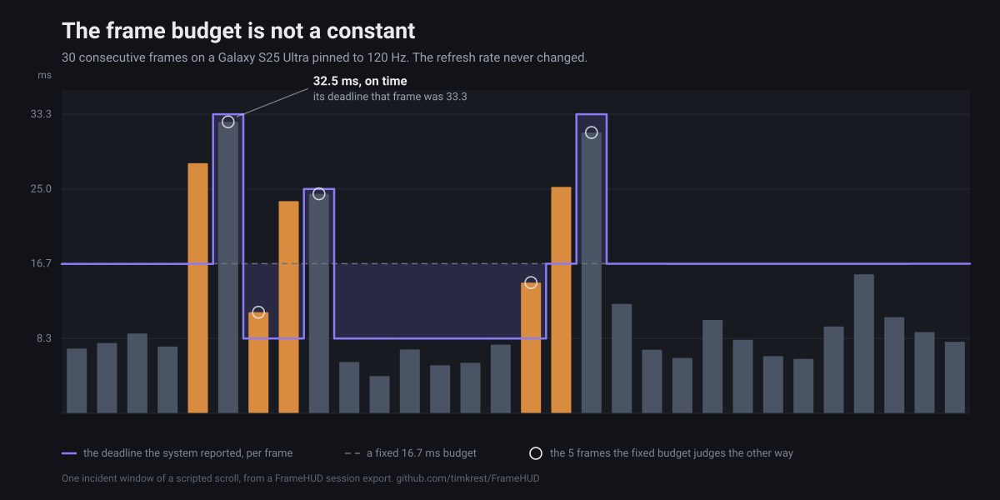

# A jank percentage doesn't say where the frame went

[English](article-frame-phases.md) · [Русский](article-frame-phases.ru.md)

Two runs of the same screen, same device, same scripted scroll. One of them has a rendering bug in
it. By jank percentage, the share of frames that finished late, they are indistinguishable.

The screen is a list from the sample app of FrameHUD, a debug overlay that shows the per-frame
phase breakdown Android reports. Three versions of it: as written, with six milliseconds of
`Thread.sleep` inside a `drawBehind`, and with sixty translucent layers drawn over every row. Each
column averages two scripted 36-second scrolls on a Galaxy S25 Ultra at 120 Hz.

| | clean | `Thread.sleep(6)` in `drawBehind` | 60 translucent layers |
| --- | --- | --- | --- |
| jank | 3.8% | 6.2% | **4.3%** |
| frame p95 | 12.3 ms | 16.8 ms | 15.6 ms |
| TOTAL avg | 5.81 ms | 6.67 ms | **9.03 ms** |
| `draw` avg | 1.00 ms | **1.48 ms** | 1.05 ms |
| `command` avg | 0.43 ms | 0.43 ms | **0.99 ms** |
| `gpu` avg | 1.67 ms | 1.66 ms | **4.32 ms** |
| lost per run | 0.73 s | 1.17 s | **0.69 s** |
| bottleneck stage | CPU | CPU | **GPU** |

The right-hand column first. Jank 4.3% against a clean run's 3.8% — 0.44 of a point, about what two
runs of the same overdraw screen differ by. Lost time *lower* than the clean run. On this phone that
screen ships.

The phases disagree. Averaged over the run a frame costs 55% more than a clean one, `command` more
than doubled, and the GPU went from 1.67 ms to 4.32, two and a half times over, enough on its own to
move the bottleneck stage from CPU to GPU. Whatever headroom made the top-line numbers look fine has
been spent. Put that screen on a weaker GPU and it is the one that stutters.

The middle column is a different bug: half a millisecond added to `draw`, `command` and `gpu`
untouched, 1.17 s of lost time. Jank noticed that one. It still would not have said which of the two
screens to open, or which file to open in it.

Both bugs are mine, load switches in the sample app, so the method is spelled out rather than
summarised. Android 16, display pinned to 120 Hz, the same scripted fling every time, about 36
seconds and ~3300 frames per run, session exported after each one. No run reported a confidence
issue. The two clean runs came out 0.06 jank points apart and the two overdraw runs 0.37; the two
sleep runs 1.3, already wider than the gap between the clean column and the overdraw one. What the
table is evidence for is narrower than "the library works": a per-frame phase breakdown separates
two cases that a frame counter reports as the same.

## Where the numbers come from

All of them from
[`FrameMetrics`](https://developer.android.com/reference/android/view/FrameMetrics), which Android
has reported per frame since API 24: input handling, animation callbacks, measure and layout, draw
recording, sync to the render thread, command issue, buffer swap, and on API 31+ the GPU duration.
The deadline comes from the system `DEADLINE` field on API 31+ rather than a hardcoded 16.7, and it
belongs to the frame rather than to the display: in the incident windows these runs kept, this phone
reported 8.3 ms for a fifth of the frames, 16.7 for seven in ten and 25.0 or more for the rest,
while the refresh rate never left 120 Hz. Judge every frame against one number derived from the
refresh rate and you disagree with the system about which frames were late.



FrameHUD puts that breakdown on top of the running app and keeps statistics from it.

```kotlin
debugImplementation("com.timkrest:framehud:0.18.1")
```

Nothing to call. A `ContentProvider` brings the panel up at startup and it follows whichever
activity has focus. `minSdk` 24, Apache 2.0,
[github.com/timkrest/FrameHUD](https://github.com/timkrest/FrameHUD).


## The panel

The top of that panel as text, mid-fling with the sixty layers on. Memory, GC, thermal and
process rows follow below the last one here:

```
▸ scroll              83 FPS
✓ ok
CPU        now   avg  peak
input      0.0   0.1   3.8
anim       2.5   1.9  27.1
layout     0.0   0.1   4.1
draw       0.0   0.9   8.8
RENDER
sync       0.0   0.0   0.3
command    0.9   0.8  10.7
swap       0.2   0.2   3.8
GPU
gpu        3.3   4.1  11.8
delay      0.9   1.3  30.4
TOTAL      7.6   9.3  48.3
over      -0.7  -8.3  40.0
pipe:gpu   3.3   4.1
win  jank  3.3%  p95  17.6  max  32.5
lost 373ms
```

Three columns: the current frame, the average over the last 120, the peak since the last reset.
`now` moves too fast to read; `avg` is the one you read, and `peak` answers whether there was a bad
frame at all once the average has recovered.

The verdict line says `✓ ok`, and it is right: jank 3.3%, and the average frame finished 8.3 ms
inside its deadline. Two rows lower, `gpu` averages 4.1 ms and `pipe:gpu` names the GPU as the
longest of the three stages — on a screen whose main-thread rows are all under a millisecond.

`over` is a frame's TOTAL minus that frame's own deadline, so negative is headroom. It also explains
the pair of numbers that look like they should subtract and don't: TOTAL averages 9.3 ms and `over`
averages -8.3, because the frames behind those two averages were not all judged against the same 8.3
ms. `lost` adds up how far the late frames went past their deadlines: a jank percentage counts an 18
ms frame and a 300 ms frame identically, lost time separates a stutter from a freeze.

`TOTAL` took me a while to stop misreading. The phases are not sequential, because the main thread
is already working on the next frame while the render thread finishes this one. The sum is not what
the frame cost, and under sustained load the frame rate is bounded by the longest stage rather than
the total. Hence `pipe:cpu|rt|gpu`. Read TOTAL as a cost and you will optimise a stage that had
headroom.

The panel draws in a window of its own, so its own layout and draw stay out of the app's frames.
Every row is
[documented separately](https://github.com/timkrest/FrameHUD/blob/main/docs/metrics.md).


## Incidents

A jank burst or a frozen frame keeps the frames around itself — sixty before the trigger, thirty
after — plus the memory, thermal, process and counter readings from that moment. One from the
`sleep` run:

```
jankBurst WARNING · worst frame 26.5 ms · budget 8.3 ms · cause: CPU stage, 3.5 ms avg
screen load · mark scroll · loads="Block main thread"
90 frames kept, 60 of them from before the trigger · seen 15 times
heap 19/256 MB · gc x2, 41 ms · thermal none, headroom 0.72 · rows composed 160
```

`rows composed` is a counter the app registered itself, and `mark scroll` is the app naming the
interaction these frames belong to. Neither comes from `FrameMetrics`, and without them the report
can only say that a bad second happened somewhere.

`seen 15 times` is fifteen separate bursts that blamed the same stage on the same screen under the
same mark, collapsed into one incident keeping the worst window. The overdraw run produced its own
incident, blaming the GPU stage instead.

When the main thread has not delivered a frame for 300 ms, a background thread samples its stack:
immediately, then after 100 ms, then at a pause doubling to 800 ms. The backoff is not politeness.
Each sample stops the thread at a safepoint, and a stack taken from a thread that has not moved
repeats the one before it.

Nothing in the sample used to hold the main thread that long, so I added a switch that does: 900 ms
of `Thread.sleep` on the main thread, every five seconds. What it leaves behind:

```
frozenFrames · screen row/{index} · loads="Freeze"
90 frames kept, 87 of them from before the trigger · seen 4 times
worst frame 922 ms · heap 20/256 MB · gc x1, 34 ms · thermal none, headroom 0.72
main thread blocked 1007 ms · 3 stacks
  java.lang.Thread.sleep(Native Method)
  com.timkrest.framehud.sample.load.FreezeKt.freezeMainThread(Freeze.kt:21)
  com.timkrest.framehud.sample.load.FreezeKt$Freeze$1$1.invokeSuspend(Freeze.kt:15)
```

Three stacks out of a one-second block, all three naming the same line — which is what the backoff
is there to stop paying for. 87 frames before the trigger and 3 after, because a frozen screen draws
almost nothing afterwards and the window closes on its timeout instead of on frames.

That run is also the argument for the next section. Every freeze run came back marked
*refreshRateChanged*, having seen both 60 and 120 Hz. My guess is the panel dropped its rate while
the app was not feeding it and picked it up again afterwards, but I never watched that happen.
Either way the mark taints the jank percentage, the lost time and the longest streak, and the run
that shows the stack best is a run no threshold should be allowed to score.

## Thresholds that survive a second device

Fixed thresholds were the first thing I shipped. They held on one phone and flapped on the other:
same commit, same test, different verdict. A threshold is a claim about a device, and I had been
writing it as a claim about the code.

So a threshold can instead be relative to a **baseline**: one averaged number per interval, kept in
a file next to the reports, which CI pulls after a run and pushes back before the next. A run is
compared with earlier runs on the same device and the same Android version; a baseline from another
device comes back inconclusive rather than pass or fail.

```kotlin
@get:Rule val noJank = DetectJankAfterTestSuccess(JankThresholds(maxJankPercent = 2f))
```

The gate is also allowed to say it doesn't know, which matters more than the baseline does. With
only pass and fail available, a bad measurement still has to be called one of them, and it gets
called a pass. Dropped `FrameMetrics` reports, a listener of your own holding the metrics thread,
throttling, power saving, a low battery, a refresh-rate change mid-run, an emulator, too short a
sample: each taints specific figures, and a threshold reading a tainted figure returns
*inconclusive* instead of green. An emulator only puts the render-thread and GPU phases in doubt,
while the main thread and the jank percentage are measured honestly there, and those are what the
gate usually reads.

Sessions export as JSON and as a self-contained HTML report into the app's external files directory,
so CI collects them with `adb pull` and no root. The same run drives over adb without a rebuild:
screens, marks, export, baseline. That is what a release-signed QA flavour buys — R8 has run, and
the timings are the ones a user's device will get.
[The guide](https://github.com/timkrest/FrameHUD/blob/main/docs/guide.md) has the commands.


## What it costs

Collection runs on its own thread at background priority and yields to the app's threads under load.
Thermal status and battery are read once a second rather than per frame, because those are Binder
calls into `system_server`. PSS and descriptor counts are sampled every five seconds on a separate
thread, because reading PSS walks every mapping of the process. The panel is a window redrawn no
more often than every 400 ms by default, and `framehud-metrics` is the same collection without it:
no window, no overlay permission, everything readable from the app as `StateFlow`s.

I have not measured the total overhead honestly, which would take the same scripted run with the
library in and with it removed, comparing process CPU time from a trace. Until that number exists,
read the paragraph above as a description of where the cost is, not a claim about its size.

Release builds get nothing. `debugImplementation` keeps the panel, its provider and the
`SYSTEM_ALERT_WINDOW` out. The one line a release build can take is `framehud-noop`, a mirror of the
API with empty bodies, and only if `FrameHud` is called outside `src/debug`, so those lines still
compile.

## Limits

A reading trap first. An app drawing nothing still scores badly. Frames happen when something
changes, so on a still screen the few that arrive come long after the deadline and count as janky —
97% on an idle screen here. The percentage answers how many of the frames this app drew were late,
never whether the app is busy.

- **Cold start** is Macrobenchmark's job. FrameHUD measures the screen in front of you, including
  its first and usable frame.
- **Recompositions are invisible.** Through `FrameMetrics` alone, a screen recomposing everything
  just looks slow.
- **Vulkan, OpenGL and game engines** are out; `FrameMetrics` says nothing about them.
- **It does not replace Perfetto.** It leaves marks and can pull a ring-buffer trigger when an
  incident opens; the analysis stays there.
- **Nothing is uploaded.** Reports sit in the app's files.
- **On an emulator** the render thread and GPU belong to the host: those rows are dimmed, marked
  `· host`, and never named by the verdict.
- **Versions:** `gpu` needs API 31 and a driver that reports it, the first-frame event needs API 29,
  and below API 26 no `FullyDrawnReporter` report arrives. The second phone here is an API 30 Redmi
  9C: no `gpu` row at all, and `pipe` can only ever blame the CPU or the render thread. A scroll
  that costs it 21.8 ms a frame gets no GPU reading to go with that.


One comparison not to make: a p95 from here against a p95 from Macrobenchmark. Different quantities,
a whole frame against CPU duration, a manual pass against repeated iterations.
[The comparison doc](https://github.com/timkrest/FrameHUD/blob/main/docs/comparison.md) covers
where each tool belongs, JankStats included: it stands on the same `FrameMetrics` from the same
API 24 and hands you a frame and a flag, with storage, aggregation and display left to write.

## Links

```kotlin
debugImplementation("com.timkrest:framehud:0.18.1")
```

- [github.com/timkrest/FrameHUD](https://github.com/timkrest/FrameHUD)
- [Guide](https://github.com/timkrest/FrameHUD/blob/main/docs/guide.md) — config, events,
  incidents, flight recorder, screens and marks, export, baselines, the jank gate
- [Reading the panel](https://github.com/timkrest/FrameHUD/blob/main/docs/metrics.md)
- The sample with the load switches: `./gradlew :sample:installDebug`

The public API may change before 1.0; the
[changelog](https://github.com/timkrest/FrameHUD/blob/main/CHANGELOG.md) says what to write
instead of whatever went away.

Which row is missing from this panel for you? I have candidates and no way to rank them from an S25
Ultra and a Redmi 9C.