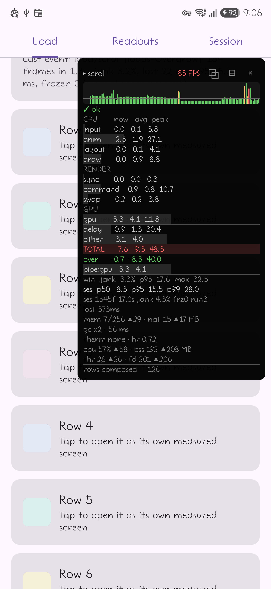
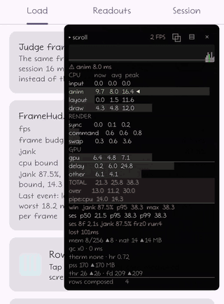
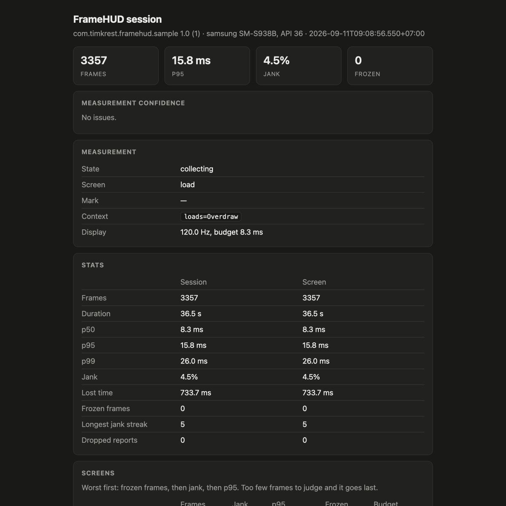

# Процент джанка не говорит, куда ушёл кадр

[English](article-frame-phases.md) · [Русский](article-frame-phases.ru.md)

Два прогона одного экрана, одно устройство, один и тот же скриптованный скролл. В одном из них есть
баг отрисовки. По проценту джанка они неразличимы.

Galaxy S25 Ultra, Android 16, дисплей прибит к 120 Гц. Один и тот же скриптованный инерционный
скролл каждый раз, около 36 секунд и ~3300 кадров на прогон, по два прогона на колонку усреднены,
сессия экспортируется после каждого. Ни один прогон не отметился проблемой достоверности. Два чистых
прогона разошлись на 0.06 пункта джанка, два прогона с overdraw — на 0.37, а два прогона со `sleep`
— на 1.3, что уже шире разрыва между чистой колонкой и колонкой с overdraw.

| | чисто | `Thread.sleep(6)` в `drawBehind` | 60 полупрозрачных слоёв |
| --- | --- | --- | --- |
| джанк | 3.8% | 6.2% | **4.3%** |
| p95 кадра | 12.3 мс | 16.8 мс | 15.6 мс |
| TOTAL avg | 5.81 мс | 6.67 мс | **9.03 мс** |
| `draw` avg | 1.00 мс | **1.48 мс** | 1.05 мс |
| `command` avg | 0.43 мс | 0.43 мс | **0.99 мс** |
| `gpu` avg | 1.67 мс | 1.66 мс | **4.32 мс** |
| потеряно за прогон | 0.73 с | 1.17 с | **0.69 с** |
| узкое место | CPU | CPU | **GPU** |

Правая колонка — шестьдесят полупрозрачных слоёв поверх каждой строки списка. Джанк 4.3% против 3.8%
на чистом прогоне — 0.44 пункта, примерно столько же, на сколько расходятся два прогона одного и
того же экрана с overdraw. Потерянного времени *меньше*, чем на чистом. На этом телефоне такой экран
уезжает в релиз.

Фазы говорят другое. Кадр стоит на 55% дороже чистого, `command` вырос больше чем вдвое, а GPU — с
1.67 мс до 4.32, в два с половиной раза, отчего узкое место само переехало с CPU на GPU. Запас,
благодаря которому верхние числа выглядели прилично, потрачен. Тот же экран на более слабой графике
и будет тем, который дёргается.

Средняя колонка — другой баг: полмиллисекунды к `draw`, `command` и `gpu` не тронуты, 1.17 с
потерянного времени. Джанк этот случай заметил. Но и он не сказал бы, который из двух экранов
открывать и какой файл в нём править.

Оба бага мои — это переключатели нагрузки в примере, и это демо, потому методика выписана выше, а не
пересказана. Доказывает таблица нечто более узкое, чем «библиотека работает»: разбивка кадра по
фазам разделяет два случая, которые счётчик кадров показывает одинаковыми.

## Откуда числа

Все — из [`FrameMetrics`](https://developer.android.com/reference/android/view/FrameMetrics),
который Android отдаёт на каждый кадр начиная с API 24: обработка ввода, колбэки анимаций, measure и
layout, запись отрисовки, синхронизация с render-потоком, выдача команд, swap буферов, а на API 31+
и длительность GPU. Дедлайн берётся из системного поля `DEADLINE` на API 31+, а не захардкожен как
16.7, и принадлежит он кадру, а не дисплею: в окнах инцидентов, которые сохранили эти прогоны,
телефон отдал 8.3 мс для пятой части кадров, 16.7 для семи из десяти и 25.0 и больше для остальных —
при том что частота не уходила со 120 Гц. Суди каждый кадр по одному числу, выведенному из частоты
обновления, — и разойдёшься с системой в том, какие кадры опоздали.

FrameHUD кладёт эту разбивку поверх работающего приложения и ведёт по ней статистику.

```kotlin
debugImplementation("com.timkrest:framehud:0.18.1")
```

Вызывать нечего: `ContentProvider` поднимает панель на старте, и она следует за той активити, у
которой фокус. `minSdk` 24, Apache 2.0,
[github.com/timkrest/FrameHUD](https://github.com/timkrest/FrameHUD).



## Панель

Верх той панели текстом, в середине инерции с включёнными шестьюдесятью слоями. Ниже последней
показанной строки идут строки памяти, GC, троттлинга и процесса:

```
▸ scroll              83 FPS
✓ ok
CPU        now   avg  peak
input      0.0   0.1   3.8
anim       2.5   1.9  27.1
layout     0.0   0.1   4.1
draw       0.0   0.9   8.8
RENDER
sync       0.0   0.0   0.3
command    0.9   0.8  10.7
swap       0.2   0.2   3.8
GPU
gpu        3.3   4.1  11.8
delay      0.9   1.3  30.4
TOTAL      7.6   9.3  48.3
over      -0.7  -8.3  40.0
pipe:gpu   3.3   4.1
win  jank  3.3%  p95  17.6  max  32.5
lost 373ms
```

Три колонки: текущий кадр, среднее по последним 120, пик с момента последнего сброса. `now` слишком
прыгает, чтобы его читать; читают `avg`, а `peak` отвечает, был ли вообще плохой кадр, когда среднее
уже восстановилось.

Строка вердикта говорит `✓ ok`, и она права: джанк 3.3%, а средний кадр закончился на 8.3 мс раньше
своего дедлайна. Двумя строками ниже `gpu` в среднем 4.1 мс, а `pipe:gpu` называет GPU самой длинной
из трёх стадий — на экране, где все строки главного потока меньше миллисекунды.

`over` — это TOTAL кадра минус собственный дедлайн этого кадра, то есть отрицательное значение
означает запас. Оно же объясняет пару чисел, которые выглядят так, будто должны вычитаться, и не
вычитаются: TOTAL в среднем 9.3 мс, а `over` в среднем −8.3, потому что кадры за этими двумя
средними судили не по одним и тем же 8.3 мс. `lost` складывает, насколько опоздавшие кадры вышли за
свои дедлайны: процент джанка считает кадр в 18 мс и кадр в 300 мс одинаково, а потерянное время
отличает рывок от фриза.

С `TOTAL` я перестал ошибаться не сразу. Фазы идут не последовательно: главный поток уже работает
над следующим кадром, пока render-поток доделывает этот. Сумма — не то, во что обошёлся кадр, и под
долгой нагрузкой частота ограничена самой длинной стадией, а не суммой. Отсюда `pipe:cpu|rt|gpu`.
Читая TOTAL как стоимость, оптимизируешь стадию, у которой был запас.

Панель рисуется в собственном окне, поэтому её собственные layout и draw не попадают в кадры
приложения. Каждая строка
[описана отдельно](https://github.com/timkrest/FrameHUD/blob/main/docs/metrics.md).



## Инциденты

Всплеск джанка или замороженный кадр сохраняет кадры вокруг себя — шестьдесят до триггера и тридцать
после — плюс показания памяти, троттлинга, процесса и счётчиков на тот момент. Вот один из прогона
со `sleep`:

```
jankBurst WARNING · worst frame 26.5 ms · budget 8.3 ms · cause: CPU stage, 3.5 ms avg
screen load · mark scroll · loads="Block main thread"
90 frames kept, 60 of them from before the trigger · seen 15 times
heap 19/256 MB · gc x2, 41 ms · thermal none, headroom 0.72 · rows composed 160
```

`rows composed` — счётчик, который приложение завело само, а `mark scroll` — это приложение называет
взаимодействие, которому принадлежат кадры. Ни то, ни другое не приходит из `FrameMetrics`, и без
них отчёт может сказать только, что где-то случилась плохая секунда.

`seen 15 times` — пятнадцать отдельных всплесков, которые винили одну стадию на одном экране под
одной меткой и схлопнулись в один инцидент с сохранением худшего окна. Прогон с overdraw выдал свой
инцидент, винящий уже стадию GPU.

Если главный поток не выдал кадр 300 мс, фоновый поток снимает его стек: сразу, затем через 100 мс,
затем с паузой, удваивающейся до 800 мс. Это отступление не из вежливости. Каждый снимок
останавливает поток на safepoint, а стек, снятый с потока, который не сдвинулся, повторяет
предыдущий.

Ничто в примере раньше не держало главный поток так долго, поэтому я добавил переключатель, который
держит: 900 мс `Thread.sleep` на главном потоке каждые пять секунд. Что после него остаётся:

```
frozenFrames · screen row/{index} · loads="Freeze"
90 frames kept, 87 of them from before the trigger · seen 4 times
worst frame 922 ms · heap 20/256 MB · gc x1, 34 ms · thermal none, headroom 0.72
main thread blocked 1007 ms · 3 stacks
  java.lang.Thread.sleep(Native Method)
  com.timkrest.framehud.sample.load.FreezeKt.freezeMainThread(Freeze.kt:21)
  com.timkrest.framehud.sample.load.FreezeKt$Freeze$1$1.invokeSuspend(Freeze.kt:15)
```

Три стека с секундного блока, и все три называют одну и ту же строку — ровно то, за что отступление
и перестаёт платить. 87 кадров до триггера и 3 после, потому что замороженный экран дальше почти
ничего не рисует, и окно закрывается по своему таймауту, а не по кадрам.

Этот же прогон — аргумент для следующего раздела. Каждый прогон с freeze вернулся помеченным
*refreshRateChanged*, увидев и 60, и 120 Гц. Подозреваю, что панель сбросила частоту, пока
приложение её не кормило, и подняла обратно потом, но сам я этого не видел. Так или иначе метка
портит процент джанка, потерянное время и самую длинную серию, а прогон, который лучше всего
показывает стек, — это прогон, который ни одному порогу не позволено оценивать.

## Пороги, которые переживают второе устройство

Фиксированные пороги я сделал первыми. На одном телефоне они держались, на другом флапали: тот же
коммит, тот же тест, другой вердикт. Порог — это утверждение об устройстве, а я писал его как
утверждение о коде.

Поэтому порог можно задавать относительно **базлайна**: одно усреднённое число на интервал, лежащее
файлом рядом с отчётами, которое CI забирает после прогона и кладёт обратно перед следующим. Прогон
сравнивается с прошлыми прогонами на том же устройстве и той же версии Android, а базлайн с другого
устройства возвращается как inconclusive, а не как «прошёл» или «упал».

```kotlin
@get:Rule val noJank = DetectJankAfterTestSuccess(JankThresholds(maxJankPercent = 2f))
```

И гейту позволено сказать, что он не знает, — это важнее самого базлайна. Когда в наличии только
«прошёл» и «упал», плохое измерение всё равно придётся назвать одним из двух, и называют его
«прошёл». Потерянные отчёты `FrameMetrics`, ваш собственный слушатель, задержавший поток метрик,
троттлинг, энергосбережение, низкий заряд, смена частоты посреди прогона, эмулятор, слишком короткая
выборка — каждое портит конкретные числа, и порог, читающий испорченное число, возвращает
*inconclusive* вместо зелёного. Эмулятор, например, ставит под сомнение только фазы render-потока и
GPU, тогда как главный поток и процент джанка там измеряются честно, — а гейт обычно читает именно
их.

Сессии выгружаются как JSON и как самодостаточный HTML-отчёт во внешнюю files-директорию приложения,
так что CI забирает их через `adb pull` без рута. Тот же прогон управляется по adb без пересборки —
экраны, метки, экспорт, базлайн, — для чего и нужен QA-флейвор с релизной подписью: R8 отработал, и
тайминги те же, что получит устройство пользователя. Команды есть
[в гайде](https://github.com/timkrest/FrameHUD/blob/main/docs/guide.md).



## Чего это стоит

Сбор идёт на своём потоке с фоновым приоритетом и уступает потокам приложения под нагрузкой.
Троттлинг и батарея читаются раз в секунду, а не на кадр, потому что это Binder-вызовы в
`system_server`. PSS и счётчики дескрипторов снимаются раз в пять секунд на отдельном потоке, потому
что чтение PSS обходит все маппинги процесса. Панель — это окно, перерисовываемое не чаще, чем раз в
400 мс по умолчанию, а `framehud-metrics` — тот же сбор без него: ни окна, ни разрешения на оверлей,
и всё, что на панели, читается из приложения как `StateFlow`-ы.

Честно суммарные накладные расходы я не мерил — для этого нужен тот же скриптованный прогон с
библиотекой и со снятой библиотекой, со сравнением CPU-времени процесса по трейсу. Пока этого числа
нет, читайте абзац выше как описание того, где находится цена, а не как утверждение о её величине.

Релизная сборка не получает ничего: `debugImplementation` оставляет за бортом панель, её провайдер и
`SYSTEM_ALERT_WINDOW`, а `framehud-noop` существует только чтобы вызовы вне `src/debug`
компилировались.

## Границы

Сначала ловушка чтения: приложение, которое ничего не рисует, всё равно получает плохую оценку.
Кадры случаются, когда что-то меняется, поэтому на застывшем экране те немногие, что приходят,
приходят сильно позже дедлайна и считаются джанковыми — здесь выходит 97% на простаивающем экране.
Процент отвечает, сколько из нарисованных приложением кадров опоздали, а не занято ли приложение.

- **Холодный старт** — работа Macrobenchmark. FrameHUD измеряет экран перед тобой, включая его
  первый и пригодный к работе кадр.
- **Рекомпозиции не видны.** Через один только `FrameMetrics` экран, который рекомпозит всё, просто
  выглядит медленным.
- **Vulkan, OpenGL и игровые движки** мимо: `FrameMetrics` про них ничего не говорит.
- **Это не замена Perfetto.** Он расставляет метки и умеет дёрнуть триггер кольцевого буфера, когда
  открывается инцидент; анализ остаётся там.
- **Никуда ничего не отправляется.** Отчёты лежат в файлах приложения.
- **На эмуляторе** render-поток и GPU принадлежат хосту: эти строки притушены, помечены `· host` и
  никогда не называются вердиктом.
- **Версии:** `gpu` требует API 31 и драйвера, который его отдаёт, событие первого кадра — API 29, а
  ниже API 26 не доходит ни один отчёт через `FullyDrawnReporter`. Второй телефон здесь — Redmi 9C
  на API 30: строки `gpu` нет вовсе, и `pipe` физически может обвинить только CPU или render-поток.
  Скролл, обходящийся ему в 21.8 мс на кадр, не получает к этому никакого показания GPU.


Одно сравнение, которого делать не надо: p95 отсюда против p95 из Macrobenchmark. Это разные
величины — целый кадр против CPU duration, ручной проход против повторяемых итераций.
[Документ со сравнением](https://github.com/timkrest/FrameHUD/blob/main/docs/comparison.md)
разбирает, где чьё место, включая JankStats: он стоит на том же `FrameMetrics` с того же API 24 и
отдаёт кадр и флаг, а хранение, агрегацию и отображение оставляет вам.

## Ссылки

```kotlin
debugImplementation("com.timkrest:framehud:0.18.1")
```

- [github.com/timkrest/FrameHUD](https://github.com/timkrest/FrameHUD)
- [Гайд](https://github.com/timkrest/FrameHUD/blob/main/docs/guide.md) — конфиг, события,
  инциденты, flight recorder, экраны и метки, экспорт, базлайны, джанк-гейт
- [Чтение панели](https://github.com/timkrest/FrameHUD/blob/main/docs/metrics.md)
- Пример с переключателями нагрузки: `./gradlew :sample:installDebug`

Публичный API может измениться до 1.0;
[чейнджлог](https://github.com/timkrest/FrameHUD/blob/main/CHANGELOG.md) говорит, что писать
вместо того, что ушло.

Какой строки вам на этой панели не хватает? У меня есть кандидаты и никакой возможности расставить
их по важности, имея S25 Ultra и Redmi 9C.