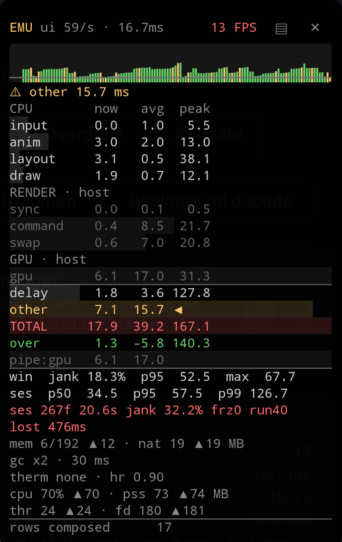

# Reading the panel

[English](metrics.md) · [Русский](metrics.ru.md)

Rows read `now avg peak` in milliseconds: the current frame, the average over the sampling window
(120 frames by default), and the peak since the last reset. Rows summed from other rows — `other`
and `pipe` — stop after `avg`, since they track no peak of their own.

The frame budget is `FrameMetrics.DEADLINE` (API 31+, what the system allotted the frame) or
`1000 / refreshRate`. At 60 Hz that is 16.7 ms. It is shown in the header.

On a static screen the numbers stop moving. No frames are being produced, so there is nothing to
report.

## Controls

Drag the panel with a finger. Tap a collapsed panel to expand it. Long-press to freeze: the readings
hold still so you can read them while collection continues. `×` resets the window, the session and
the peaks.

## Header

- **ui N/s** — Choreographer ticks the main thread handled in the last second. Drops below the display
  rate when the main thread is busy; fluctuates on LTPO displays (60↔120)
- **FPS** — frames actually rendered in the last second. `idle` means no frames at all: a static
  screen, or a frozen main thread

## CPU (main thread)

Work on the UI thread — where all your Compose and View code lives.

| Row | What it covers | Grows when |
| --- | --- | --- |
| `input` | Touch and key dispatch, including every `onClick`/`onTouch` callback | Handlers do heavy work |
| `anim` | Evaluating running animations (`Animatable`, `animate*AsState`, `Transition`) | Many animations run at once |
| `layout` | Measure and layout of every View and composable | Deep hierarchies, frequent recomposition, intrinsic measurements |
| `draw` | Recording draw commands into the display list (`Canvas.draw*`, text, backgrounds) | Many elements on screen |

## RENDER (render thread)

The Android thread that takes the display list from the UI thread and turns it into GPU work.

| Row | What it covers | Grows when |
| --- | --- | --- |
| `sync` | Syncing the display list, plus uploading bitmaps as GPU textures | Images are large or newly decoded |
| `command` | Translating draw commands into OpenGL/Vulkan calls | Hierarchies and layers get complex |
| `swap` | Waiting for the GPU to finish the previous frame, then presenting this one (`eglSwapBuffers`) | The GPU is saturated |

## GPU

`gpu` — time the GPU spends rasterizing the frame: shaders, textures, layer blending. Needs API 31+
and a driver that reports it. The row reads `n/a` until real timings arrive, which some drivers never
send.

## Everything else

- `delay` — from the vsync signal to the frame actually starting. Grows when the main thread is busy
  with something else: a heavy callback, IO, or the previous frame still running
- `other` — the remainder of TOTAL not attributed to a phase. Normally near zero
- `TOTAL` — the full frame, vsync to completion. Should stay within budget
- `over` — TOTAL minus budget: the overrun, where negative means headroom
- `pipe:cpu|rt|gpu` — the stage with the highest average and its timings. The stages run in parallel,
  so under sustained load the frame rate is bound by this stage, not by TOTAL

## Footer

- **jank** — a frame that missed the system deadline (`FrameMetrics.DEADLINE` on API 31+;
  `TOTAL > budget` before that)
- **win** — the sampling window: jank share, p95 and worst frame
- **ses** — since the last reset: p50/p95/p99, frame count and collection time (background time
  excluded), jank share, `frz` for frozen frames (TOTAL > 700 ms, as in Play Vitals), `run` for the
  longest streak of consecutive janky frames
- **lost** — how far the late frames ran past the deadline, summed. Only shown above zero. Jank
  share counts an 18 ms frame and a 300 ms frame the same; this keeps them apart
- **drop** — `FrameMetrics` reports the system dropped before delivery. Only shown when above zero:
  averages and p95 are undersampled, so read them with suspicion
- **mem** — Java heap used/limit and native heap, `▲` marking peaks since reset. Climbing as you
  navigate back and forth means a leak
- **gc** — collections and total GC time since the last reset, counting only while a screen was on
  top. Rising in step with jank means memory pressure is costing you frames
- **therm** — `PowerManager` throttling status and headroom, where 1.0 is the throttling threshold
  and higher means already throttled. Hidden until the platform reports it

## Marks

While an interaction is open the header reads `▸ name` in place of the timing. It labels what is
under way, not what the figures cover: the rows below stay on the usual window and session, and only
the `MarkEnded` event reports the mark alone. Marks come from `FrameHud.mark` in your app; the panel
sets none on its own.

## Verdict

The line under the header:

- `✓ ok` — jank below 5%
- `⚠ <phase> N ms` — the phase with the highest average, `delay` included; the same phase is marked
  `◀` in the list. Yellow at 5–20% jank, red at 20% or more. Collapsed, it shows as a `⚠<phase>` badge

## Colors

Metric rows: green means TOTAL is within budget, grey is normal, red means the window average is
above budget.

FPS against the display refresh rate: green at 95% of target or better, grey at 75% or better, red
below that.

Jank: below 5% is fine, 5–20% stutters, 20% and up is bad.

## How to read it

The current value jumps around; that is fine. Read the average.

1. **FPS against the refresh rate** — matching means smooth
2. **TOTAL average** — below budget is good
3. **jank** — the share of frames that missed the deadline
4. **p95** — sustained drops
5. **max** — one-off spikes. A high max with a healthy p95 is a single hitch, not a problem
6. **pipe** — which stage caps the frame rate under load

## Measuring a screen

1. Open the screen
2. Reset (`×`)
3. Exercise it for 5–10 seconds — scroll, navigate, animate
4. Read FPS against the refresh rate, TOTAL average, jank and p95
5. If it looks bad, the verdict and `pipe` point at the culprit

## When something is red

| Row | What to do |
| --- | --- |
| `input` | Heavy work in touch/click handlers. Move it off the callback |
| `anim` | Too many or too complex concurrent animations. Simplify, drop the redundant ones |
| `layout` | Recomposition. `remember`, `derivedStateOf`, fewer invalidations |
| `draw` | Too many elements on screen. `LazyColumn`, remove what is not needed |
| `sync` | Heavy images. Check bitmap dimensions, resize in your image loader |
| `command` | Too many draw commands. Too many layers, too deep a hierarchy |
| `swap` | The GPU did not free up in time to present. Usually a symptom of heavy `gpu` |
| `gpu` | GPU saturated. Overdraw, blur, shadows, alpha layers, large textures |
| `delay` | Main thread blocked. IO or network on the wrong thread |
| `max` > 100 ms with healthy p95 | A one-off hitch. Ignore it |
| `frz` above zero | The UI visibly froze. Look for long work on the main thread |
| `gc` rising with jank | Allocations in a hot path (composition, scrolling). Profile allocations |
| `mem` near the limit | Close to OOM. Look for a leak or oversized caches |

## Trusting the numbers

The panel renders in its own window, so it does not appear in the metrics of the window being
measured.

Three things do distort readings, and the panel tells you about all of them: `drop` above zero means
the system discarded reports before delivery, so averages and percentiles are undersampled; `therm`
showing throttling means the device has clocked itself down and the timings are not comparable to a
cold device; `EMU` in the header means an emulator. Reports carry these and more as confidence
issues next to the stats, each naming the figures it taints.

## On an emulator

An emulator renders through the host machine, so `sync`, `command`, `swap` and `gpu` time a desktop
GPU and say nothing about a phone. Their section headers read `RENDER · host` and `GPU · host`, the
rows are greyed out, and the verdict skips them — as does `pipe` when the bottleneck lands there.

What survives is everything the app itself is responsible for: `input`, `anim`, `layout`, `draw`,
`delay`, TOTAL, jank and the session aggregates. Those are the numbers a jank gate reads, which is
why the gate is worth running on CI even though the rendering is not a device's.

Expect a large `other`: an emulator leaves more of the frame outside the phases the platform reports,
so the verdict often lands on that remainder rather than on a stage.
